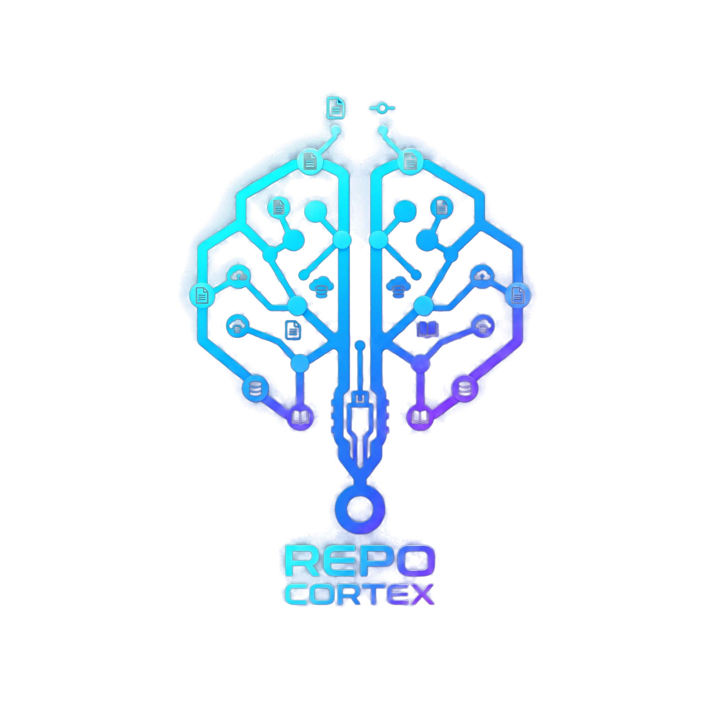

# Repo Cortex

<p align="center">
  
</p>

<p align="center">
  <strong>PowerShell-native workflow infrastructure for AI-assisted development, retrieval, governance, MCP tooling, and persistent project memory.</strong>
</p>

<p align="center">
  <a href="VERSION"></a>
  <a href="LICENSE"></a>
  <a href="#platform-scope"></a>
  <a href="#platform-scope"></a>
  <a href="#platform-scope"></a>
  <a href="#certification"></a>
</p>

Repo Cortex is the product identity for the toolkit previously described as **CodeMunch + ContextLattice + MemPalace (All-in-One)**. The underlying module is still named `LLMWorkflow`, and the command surface intentionally keeps familiar aliases such as `llmup`, `llmcheck`, `llmheal`, and `llmdashboard`.

> 

The short version: Repo Cortex gives a project a repeatable AI-workflow backbone. It can bootstrap local workflow assets, index code, wire memory sync, run structured extraction, govern MCP/tool exposure, evaluate answer quality, and certify release readiness.

---

## Contents

- [What It Does](#what-it-does)
- [Quick Start](#quick-start)
- [Core Commands](#core-commands)
- [Operator Experience](#operator-experience)
- [Architecture](#architecture)
- [Platform Scope](#platform-scope)
- [Domain Packs](#domain-packs)
- [Memory And Orchestration](#memory-and-orchestration)
- [Game-Team Workflow](#game-team-workflow)
- [Testing](#testing)
- [Certification](#certification)
- [Repository Map](#repository-map)
- [Documentation](#documentation)

---

## What It Does

Repo Cortex is organized around five practical jobs:

| Job | What Repo Cortex Provides |
|-----|---------------------------|
| Bootstrap | Project setup, reusable templates, launcher aliases, environment checks |
| Context | Code indexing, structured extraction, document ingestion, domain-pack registries |
| Memory | Vector-memory bridge tooling, ChromaDB support, ContextLattice orchestrator integration |
| Governance | Policy checks, human-review gates, golden tasks, provenance, release criteria |
| Operations | Dashboards, self-healing diagnostics, security scans, SBOMs, certification reports |

It is built for repositories that need more than a prompt folder. The platform treats AI-assisted development as an operational system with tests, policy, telemetry, release gates, and explicit evidence.

---

## Quick Start

Requirements:

- PowerShell 5.1 or PowerShell 7+
- Git
- Python where bridge, ingestion, or local test helpers require it
- Optional: Docker, ChromaDB, Ollama, and a reachable ContextLattice orchestrator

Import the module from the repository:

```powershell
Import-Module .\module\LLMWorkflow\LLMWorkflow.psd1 -Force
```

Install launcher assets:

```powershell
Install-LLMWorkflow -NoProfileUpdate
```

Bootstrap or check a project:

```powershell
llmup
llmcheck
```

Run the dashboard:

```powershell
llmdashboard
```

Uninstall launcher/profile integration:

```powershell
llmdown
```

---

## Core Commands

| Command | Full Function | Purpose |
|---------|---------------|---------|
| `llmup` | `Invoke-LLMWorkflowUp` | Bootstrap the workflow toolkit in a project |
| `llmcheck` | `Test-LLMWorkflowSetup` | Validate prerequisites and optional connectivity |
| `llmver` | `Get-LLMWorkflowVersion` | Show manifest/install version details |
| `llmupdate` | `Update-LLMWorkflow` | Install a requested or latest release artifact |
| `llmheal` | `Invoke-LLMWorkflowHeal` | Run issue detection and guided repair |
| `llmdashboard` | `Show-LLMWorkflowDashboard` | Show local workflow health and activity |
| `llmplugins` | `Get-LLMWorkflowPlugins` | Inspect registered plugins |
| `llmpalaces` | `Get-LLMWorkflowPalaces` | Inspect configured memory palaces |
| `llmsync` | `Sync-LLMWorkflowAllPalaces` | Sync configured memory sources |

The manifest exports 86 public functions plus the aliases above. See [`module/LLMWorkflow/LLMWorkflow.psd1`](module/LLMWorkflow/LLMWorkflow.psd1) for the exact export list.

---

## Operator Experience

Repo Cortex now includes a practical operator layer for deciding what matters next, inspecting evidence, and extending the platform without hand-assembling release artifacts.

| Command | Full Function | Purpose |
|---------|---------------|---------|
| `llmnext` | `Get-LLMWorkflowNextAction` | Rank the next operational action from version, certification, and security evidence |
| `llmcockpit` | `Export-LLMWorkflowCockpit` | Export a local HTML cockpit with health, next action, and release evidence |
| `llmpacknew` | `New-LLMWorkflowPackScaffold` | Scaffold a governed pack manifest, source registry, and golden task stub |
| `llmcorpus` | `Invoke-LLMWorkflowCorpusRegression` | Run file-backed real-corpus regression cases and write a report |
| `llmsecx` | `Test-LLMWorkflowSecurityExceptions` | Validate the structured security exception ledger |
| n/a | `Export-LLMWorkflowEvidenceReport` | Export answer trace/evidence reports as JSON and HTML |
| n/a | `Update-LLMWorkflowProject` | Plan or apply local project migrations from older layouts |

When a project contains a `ModernUI/` asset folder, `Export-LLMWorkflowCockpit` automatically embeds the available ModernUI PNG assets into the exported HTML so the cockpit carries the Repo Cortex app visual style without external file dependencies.

---

## Architecture

<p align="center">
  
</p>

Repo Cortex is a layered PowerShell module with templates, tools, policy artifacts, domain packs, and release automation around it.

```text
Repo Cortex
├─ module/LLMWorkflow/       PowerShell module and public command surface
├─ tools/                    Bootstrap, CodeMunch, ContextLattice, memory bridge, release, CI
├─ packs/                    Domain pack manifests, registries, and MCP toolkit descriptors
├─ policy/opa/               External policy artifacts
├─ scripts/security/         Secret scan, SBOM, vulnerability scan, security baseline
├─ scripts/release/          Release certification orchestration
├─ docs/                     Architecture, operations, implementation, release state
└─ tests/                    Pester suites and integration helpers
```

Main subsystems:

| Subsystem | Files |
|-----------|-------|
| Core primitives | `module/LLMWorkflow/core/` |
| Workflow orchestration | `module/LLMWorkflow/workflow/` |
| Ingestion and extraction | `module/LLMWorkflow/ingestion/` |
| Retrieval integrity | `module/LLMWorkflow/retrieval/` |
| Governance | `module/LLMWorkflow/governance/` and `module/LLMWorkflow/contexts/Governance/` |
| MCP | `module/LLMWorkflow/mcp/` |
| Telemetry and dashboards | `module/LLMWorkflow/telemetry/` and `module/LLMWorkflow/contexts/Telemetry/` |
| Game assets | `module/LLMWorkflow/contexts/GameAssets/` |
| Healing | `module/LLMWorkflow/contexts/Healing/` |

For detailed diagrams and flows, read [`docs/architecture/ARCHITECTURE.md`](docs/architecture/ARCHITECTURE.md) and [`docs/architecture/PLATFORM_OVERVIEW.md`](docs/architecture/PLATFORM_OVERVIEW.md).

---

## Platform Scope

Current release-state metrics:

**227 PowerShell Modules**

| Metric | Count |
|--------|------:|
| Domain packs | 10 |
| PowerShell modules | 227 |
| Exported functions | 86 |
| **Extraction Parsers** | 30 |
| Golden tasks | 60 |
| MCP tool surface | 38 |
| Benchmark suites | 5 |

These counts are tracked in [`docs/releases/RELEASE_STATE.md`](docs/releases/RELEASE_STATE.md) and cross-checked by documentation-truth tooling.

---

## Domain Packs

| Pack | Focus |
|------|-------|
| `godot-engine` | Godot scenes, GDScript, signals, engine workflows |
| `blender-engine` | Blender Python, operators, geometry nodes, export workflows |
| `rpgmaker-mz` | RPG Maker MZ plugin development, notetags, asset cataloging |
| `voice-audio-generation` | Voice, TTS/STS, audio generation pipelines |
| `agent-simulation` | Agent workflow and simulation patterns |
| `notebook-data-workflow` | Notebook and data workflow extraction |
| `ui-frontend-framework` | UI/component and design-system workflows |
| `api-reverse-tooling` | API discovery, traffic capture, reverse tooling |
| `ml-educational-reference` | ML educational and reference content |
| `engine-reference` | Cross-engine patterns and migration guidance |

Pack manifests live in [`packs/manifests/`](packs/manifests/). Source registries live in [`packs/registries/`](packs/registries/).

---

## Memory And Orchestration

Repo Cortex keeps the old integration strengths under a clearer product umbrella:

- **CodeMunch tooling**: project indexing and MCP wrapper setup
- **ContextLattice tooling**: orchestrator configuration, connectivity verification, smoke write/search
- **MemPalace bridge**: ChromaDB-backed local memory sync into the orchestrator

Important paths:

| Path | Purpose |
|------|---------|
| [`tools/codemunch/`](tools/codemunch/) | Index defaults, project bootstrap, indexing scripts |
| [`tools/contextlattice/`](tools/contextlattice/) | Orchestrator env schema, bootstrap, verify script |
| [`tools/memorybridge/`](tools/memorybridge/) | Memory bridge config, PowerShell wrapper, Python sync scripts |
| [`.codemunch/`](.codemunch/) | Local/project CodeMunch config |
| [`.contextlattice/`](.contextlattice/) | Local/project ContextLattice config |
| [`.memorybridge/`](.memorybridge/) | Local/project bridge config |

`docker-compose.yml` does not bundle a ContextLattice service by default. Set `CONTEXTLATTICE_ORCHESTRATOR_URL` to a reachable external orchestrator before relying on compose-based workflows.

---

## Game-Team Workflow

Repo Cortex includes an engine-aware scaffold for game development:

```powershell
llmup -GameTeam -GameTemplate "topdown-rpg" -GameEngine "Godot"
llmup -GameTeam -JamMode
```

The game-team preset can create:

- `docs/GDD.md`
- `docs/TASKS.md`
- `assets/ASSET_MANIFEST.json`
- `assets/art/`
- `assets/spritesheets/`
- `assets/tilemaps/`
- `assets/sfx/`
- `assets/music/`
- `assets/plugins/`
- `.llm-workflow/game-preset.json`

Related commands:

```powershell
New-LLMWorkflowGamePreset
Get-LLMWorkflowGameTemplates
Export-LLMWorkflowAssetManifest
Invoke-LLMWorkflowGameUp
```

---

## Plugins

External tools can be registered with Repo Cortex through plugin manifests:

```powershell
Register-LLMWorkflowPlugin -ManifestPath "tools/my-plugin/manifest.json"
Get-LLMWorkflowPlugins
Invoke-LLMWorkflowPlugins
Unregister-LLMWorkflowPlugin -Name "my-plugin"
```

An example plugin lives under [`tools/plugins/example-plugin/`](tools/plugins/example-plugin/).

---

## Testing

Install Pester when needed:

```powershell
Install-Module Pester -Scope CurrentUser -Force -SkipPublisherCheck
```

Run the local suite through the safe wrapper:

```powershell
.\tools\ci\invoke-pester-safe.ps1 -Path .\tests -CI
```

Focused test examples:

```powershell
.\tools\ci\invoke-pester-safe.ps1 -Path .\tests\CoreModule.Tests.ps1
.\tools\ci\invoke-pester-safe.ps1 -Path .\tests\ReleaseCertification.Tests.ps1
.\tools\ci\invoke-pester-safe.ps1 -Path .\tests\Integration.ContextLattice.Tests.ps1
```

Coverage areas include:

- Module export surface and aliases
- Provider resolver behavior
- Primitive filesystem safety
- Policy adapter and OPA fallback behavior
- Retrieval routing, confidence, cache, and answer integrity
- MCP governance
- Document ingestion and extraction
- Game asset manifests
- Golden task execution
- Security baseline checks
- Release certification

Golden Task Evaluations (60 Tasks)

Golden Task Coverage (60 Total)

The governance suite includes 60 predefined validation scenarios.

---

## Certification

<p align="center">
  
</p>

The current declared version is `0.9.6`, with v1.0 certification criteria tracked in [`docs/releases/V1_RELEASE_CRITERIA.md`](docs/releases/V1_RELEASE_CRITERIA.md).

Run release certification:

```powershell
.\scripts\Invoke-ReleaseCertification.ps1 -ProjectRoot .
```

Run release certification with strict checks:

```powershell
.\scripts\Invoke-ReleaseCertification.ps1 -ProjectRoot . -Strict
```

Run release preflight:

```powershell
.\tools\release\test-release-prereqs.ps1 -ProjectRoot .
```

Certification reports are written to [`certification-reports/`](certification-reports/). Security reports are written to [`security-reports/`](security-reports/).

The certification path checks documentation truth, branding assets, observability, module contracts, policy, ingestion, security, durable execution, MCP governance, container runtime configuration, retrieval backend implementation, and CI validation.

---

## Release Workflow

Bump the module version:

```powershell
.\tools\release\bump-module-version.ps1 -Version 0.10.0
```

Create and optionally push a release tag:

```powershell
.\tools\release\create-release-tag.ps1 -Push
```

PowerShell Gallery publishing is handled by GitHub Release automation when `PSGALLERY_API_KEY` is configured as a repository secret.

---

## Repository Map

| Path | Purpose |
|------|---------|
| [`module/LLMWorkflow/`](module/LLMWorkflow/) | Main PowerShell module |
| [`tools/workflow/`](tools/workflow/) | Install, bootstrap, doctor, and check scripts |
| [`tools/ci/`](tools/ci/) | CI validation helpers |
| [`tools/release/`](tools/release/) | Version and tag release helpers |
| [`scripts/Invoke-ReleaseCertification.ps1`](scripts/Invoke-ReleaseCertification.ps1) | Certification engine |
| [`scripts/security/`](scripts/security/) | SBOM, secret scan, vulnerability scan, security baseline |
| [`packs/`](packs/) | Pack manifests, registries, MCP toolkit descriptors |
| [`policy/opa/`](policy/opa/) | OPA-style policy bundles |
| [`docs/architecture/`](docs/architecture/) | Architecture reference |
| [`docs/operations/`](docs/operations/) | Operator guides and troubleshooting |
| [`docs/releases/`](docs/releases/) | Release state, criteria, checklist, changelog |
| [`tests/`](tests/) | Pester tests and fixtures |

---

## Documentation

Start here:

| Document | Why It Matters |
|----------|----------------|
| [`docs/architecture/PLATFORM_OVERVIEW.md`](docs/architecture/PLATFORM_OVERVIEW.md) | High-level platform model |
| [`docs/architecture/ARCHITECTURE.md`](docs/architecture/ARCHITECTURE.md) | Detailed architecture and flows |
| [`docs/releases/RELEASE_STATE.md`](docs/releases/RELEASE_STATE.md) | Current release truth and metrics |
| [`docs/releases/V1_RELEASE_CRITERIA.md`](docs/releases/V1_RELEASE_CRITERIA.md) | v1.0 exit criteria |
| [`docs/releases/RELEASE_CERTIFICATION_CHECKLIST.md`](docs/releases/RELEASE_CERTIFICATION_CHECKLIST.md) | Manual sign-off checklist |
| [`docs/implementation/PROGRESS.md`](docs/implementation/PROGRESS.md) | Implementation progress tracker |
| [`docs/implementation/LLMWorkflow_Post_0.9.6_Strategic_Execution_Plan.md`](docs/implementation/LLMWorkflow_Post_0.9.6_Strategic_Execution_Plan.md) | Strategic plan after 0.9.6 |
| [`docs/operations/TROUBLESHOOTING.md`](docs/operations/TROUBLESHOOTING.md) | Diagnosis and recovery guide |
| [`docs/architecture/SECURITY_BASELINE.md`](docs/architecture/SECURITY_BASELINE.md) | Security baseline model |
| [`docs/reference/DOCS_TRUTH_MATRIX.md`](docs/reference/DOCS_TRUTH_MATRIX.md) | Documentation drift guardrail |

---

## Safety Notes

- Keep secrets in local `.env` files and never commit them.
- Use `CONTEXTLATTICE_ORCHESTRATOR_API_KEY` for orchestrator authentication.
- Use `CONTEXTLATTICE_ORCHESTRATOR_URL` when running against an external ContextLattice service.
- Treat generated reports as evidence artifacts and refresh them before release promotion.
- Keep README, `VERSION`, module manifest, release state, and changelog aligned.

---

<p align="center">
  
</p>

<p align="center">
  <strong>Repo Cortex</strong><br/>
  </p>
