# LLM Workflow Architecture

This document provides detailed architectural diagrams and explanations of the CodeMunch + ContextLattice + MemPalace integrated workflow system.

## Related Docs
- [Post-0.9.6 Strategic Execution Plan](../implementation/LLMWorkflow_Post_0.9.6_Strategic_Execution_Plan.md)
- [Implementation Progress](../implementation/PROGRESS.md)
- [Remaining Work](../implementation/REMAINING_WORK.md)
- [Canonical Document Index](../workflow/LLMWorkflow_Canonical_Document_Set_INDEX.md)

## Table of Contents

- [Overview](#overview)
- [Phase 1 Core Infrastructure](#phase-1-core-infrastructure)
- [Main Architecture Flowchart](#main-architecture-flowchart)
- [Detailed Component Diagram](#detailed-component-diagram)
- [Data Flow Diagram](#data-flow-diagram)
- [Provider Resolution Flow](#provider-resolution-flow)
- [Sync Process Flow](#sync-process-flow)
- [Component Details](#component-details)

---

## Overview

The LLM Workflow is a unified toolkit that integrates three core components:

- **CodeMunch**: Project indexing and MCP wrapper setup
- **ContextLattice**: Project bootstrap and connectivity verification
- **MemPalace**: Vector storage with incremental bridge to ContextLattice

---

## Phase 1 Core Infrastructure

The platform implements enterprise-grade operational infrastructure. This provides state integrity, operator trust, safe continuous operation, and controlled automation.

### Core Infrastructure Stack

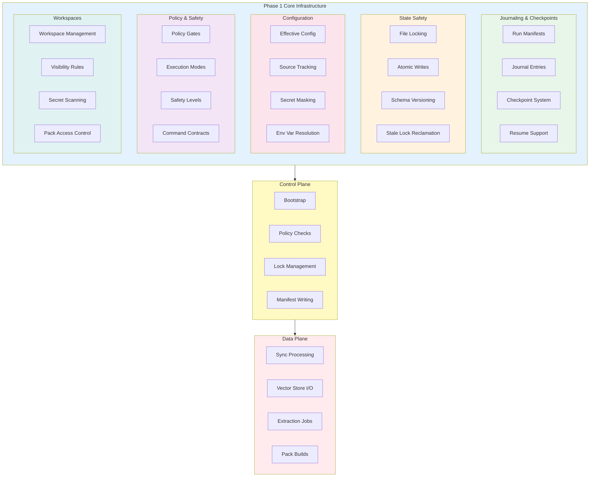

### System Invariants

| Invariant | Description | Implementation |
|-----------|-------------|----------------|
| **Command Contract** | Every command defines purpose, params, exit codes, safety level | `CommandContract.ps1` |
| **State Safety** | Atomic writes, file locking, schema versioning | `AtomicWrite.ps1`, `FileLock.ps1` |
| **Journal** | Before/after checkpoint entries for all multi-step operations | `Journal.ps1` |
| **Policy** | Policy gates checked before locks and before apply | `Policy.ps1` |
| **Secret/PII** | No secrets in logs, manifests, or exports unmasked | `Visibility.ps1` |
| **Dry-Run** | Planner/executor separation for all mutating commands | `CommandContract.ps1` |

### Configuration Precedence

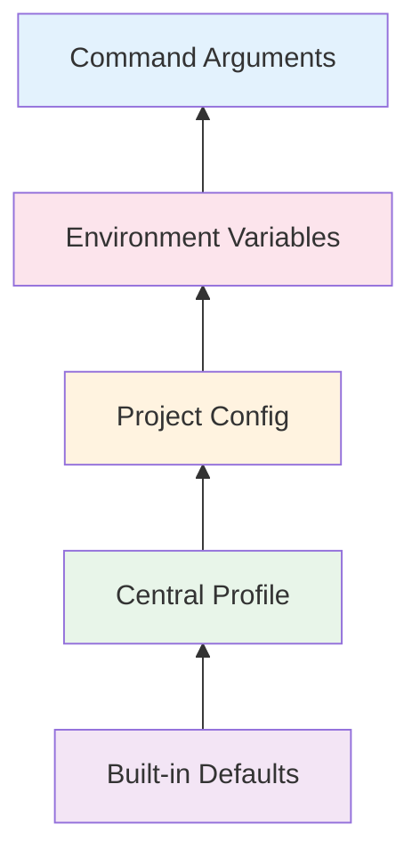

### Execution Mode Matrix

| Mode | Allowed Operations | Use Case |
|------|-------------------|----------|
| `interactive` | All operations | Human-driven development |
| `ci` | sync, index, validate, test | Continuous integration |
| `watch` | sync, index, telemetry | File watcher mode |
| `heal-watch` | safe repairs, telemetry | Proactive maintenance |
| `scheduled` | sync, backup, reports | Cron jobs |
| `mcp-readonly` | doctor, status, search, preview | Read-only access |
| `mcp-mutating` | All except delete, prune | Controlled mutations |

### Workspace Types

| Type | Visibility | Exportable | Use Case |
|------|-----------|------------|----------|
| `personal` | User-local | No | Default personal workspace |
| `project` | Project-local | Configurable | Project-specific context |
| `team` | Team-shared | Yes | Shared team knowledge |
| `readonly` | Reference only | No | External reference packs |

---

## Main Architecture Flowchart

The high-level workflow from the user's perspective:

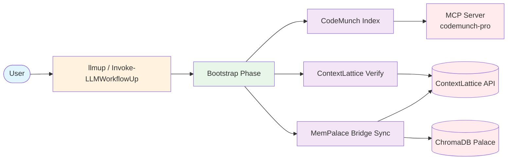

### Flow Description

1. **User** invokes `llmup` (alias for `Invoke-LLMWorkflowUp`)
2. **Bootstrap Phase** initializes all three toolchains
3. **CodeMunch Index** creates searchable project index via MCP server
4. **ContextLattice Verify** checks connectivity to the orchestrator API
5. **MemPalace Bridge Sync** synchronizes vector data to ContextLattice

---

## Detailed Component Diagram

Complete system architecture showing all components and their relationships:

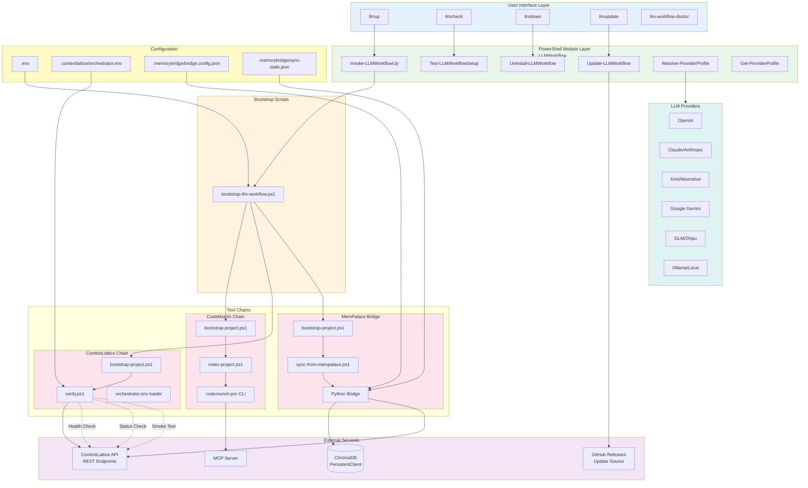

---

## Data Flow Diagram

### Primary Data Flows

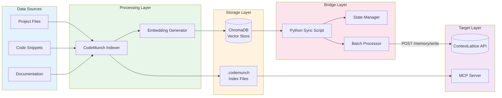

### MemPalace to ContextLattice Sync Flow

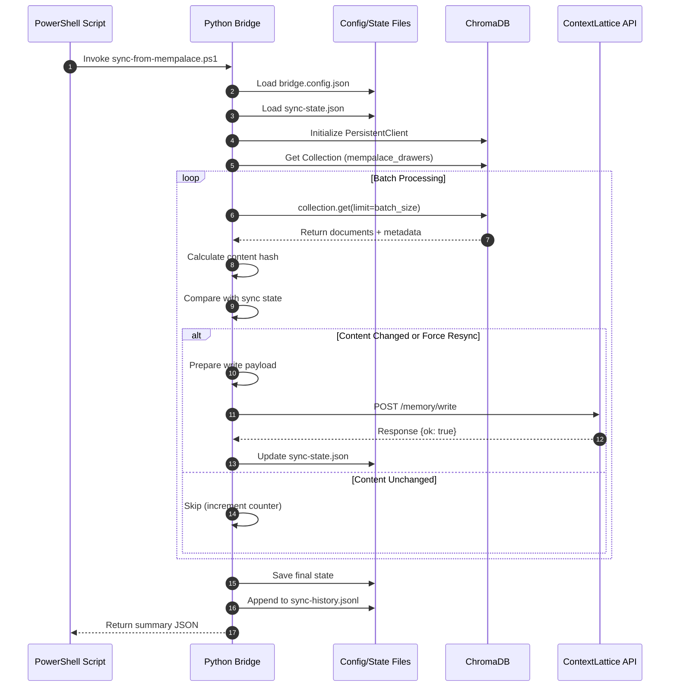

---

## Provider Resolution Flow

### Provider Selection Algorithm

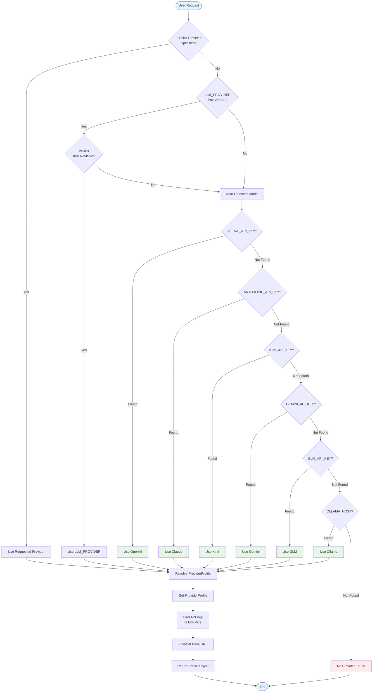

### Provider Priority Order

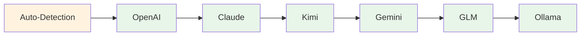

### Provider Configuration Matrix

| Provider | API Key Variables | Base URL Variables | Default Base URL |
|----------|-------------------|-------------------|------------------|
| OpenAI | `OPENAI_API_KEY` | `OPENAI_BASE_URL` | `https://api.openai.com/v1` |
| Claude | `ANTHROPIC_API_KEY`, `CLAUDE_API_KEY` | `ANTHROPIC_BASE_URL`, `CLAUDE_BASE_URL` | `https://api.anthropic.com/v1` |
| Kimi | `KIMI_API_KEY`, `MOONSHOT_API_KEY` | `KIMI_BASE_URL`, `MOONSHOT_BASE_URL` | `https://api.moonshot.cn/v1` |
| Gemini | `GEMINI_API_KEY`, `GOOGLE_API_KEY` | `GEMINI_BASE_URL` | `https://generativelanguage.googleapis.com/v1beta/openai` |
| GLM | `GLM_API_KEY`, `ZHIPU_API_KEY` | `GLM_BASE_URL` | `https://open.bigmodel.cn/api/paas/v4` |
| Ollama | `OLLAMA_API_KEY` | `OLLAMA_BASE_URL`, `OLLAMA_HOST` | `http://localhost:11434/v1` |

---

## Sync Process Flow

### Incremental Sync Workflow

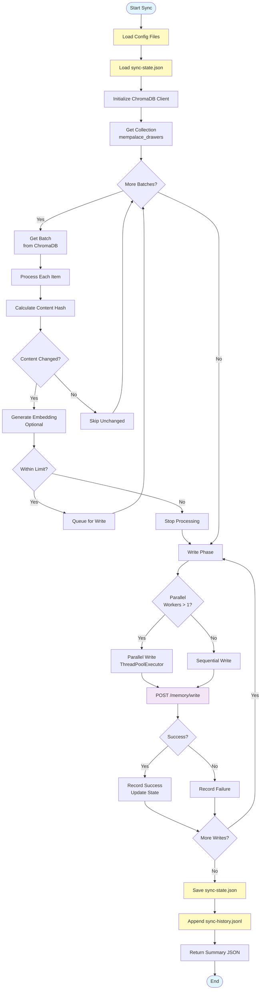

### Sync State Management

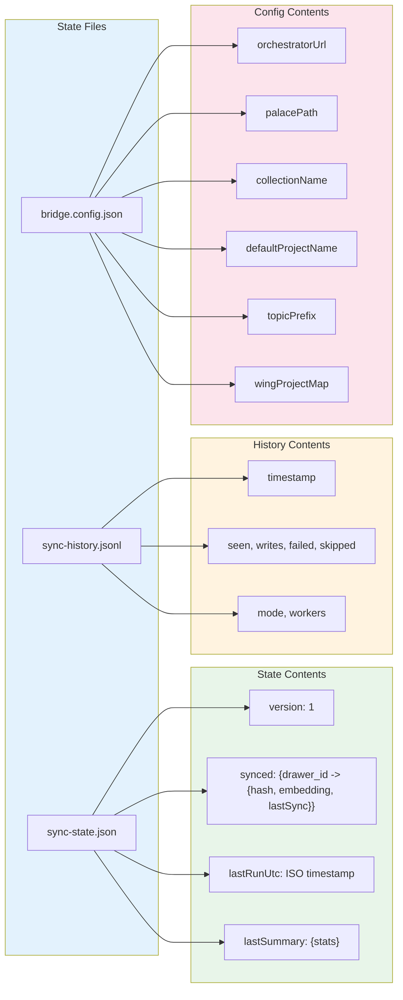

---

## Component Details

### Core Infrastructure Components

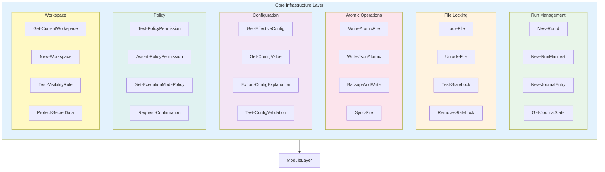

### PowerShell Module Structure

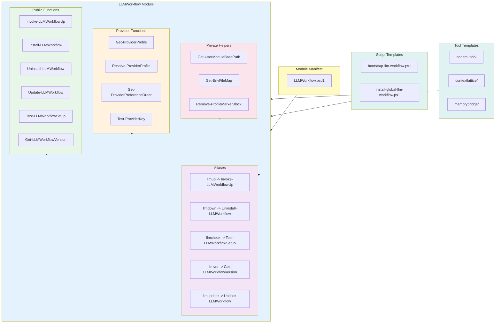

### Python Bridge Components

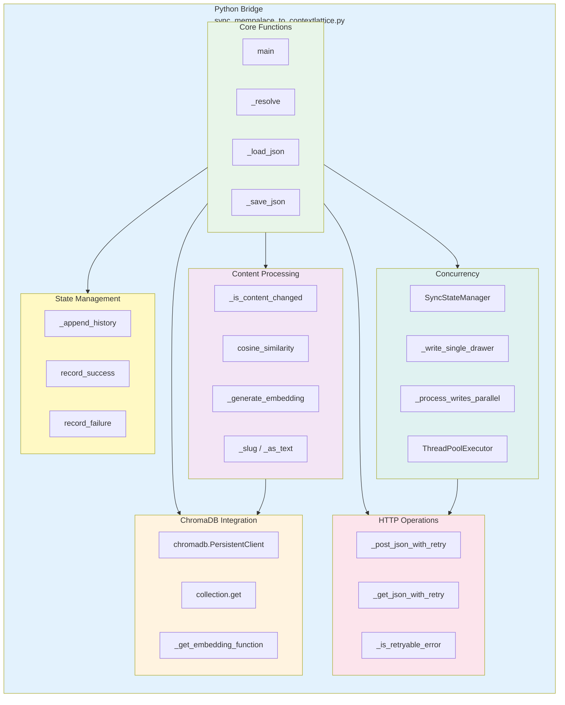

---

## Configuration File Hierarchy

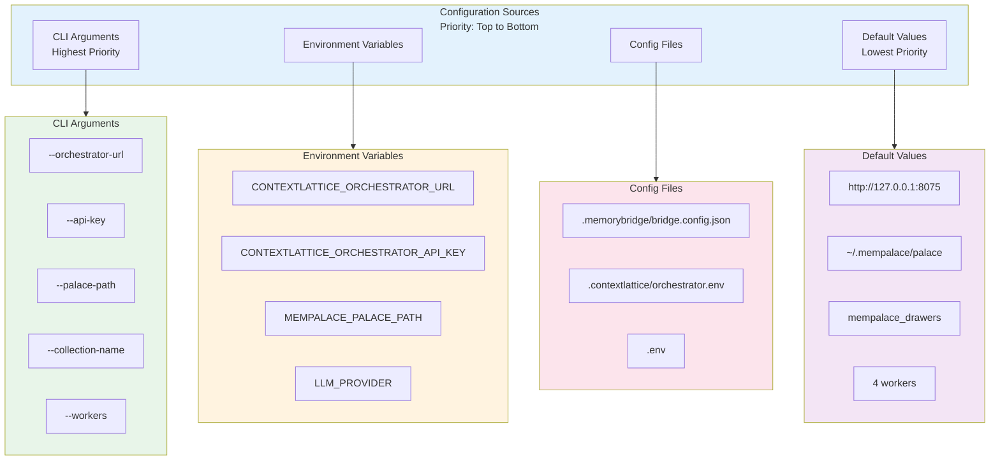

---

## Error Handling and Retry Logic

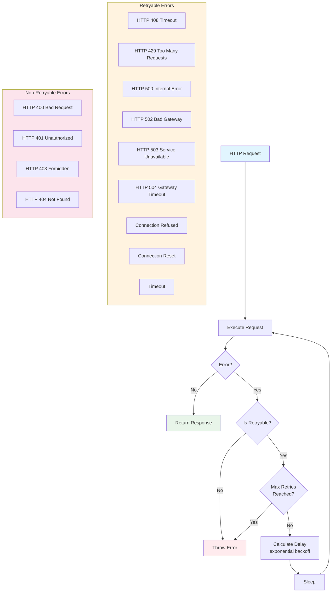
