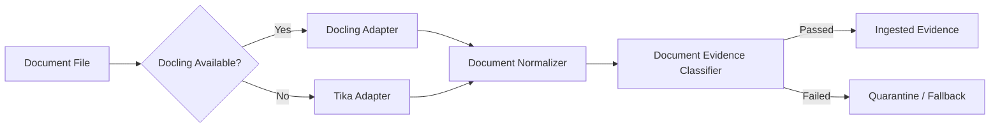

# Document Ingestion Model

## Purpose

This document defines the document ingestion pipeline for the LLM Workflow platform, covering mixed-document artifact intake, engine routing, normalization, evidence quality classification, and quarantine paths for low-quality extraction.

## Related Docs
- [Post-0.9.6 Strategic Execution Plan](../implementation/LLMWorkflow_Post_0.9.6_Strategic_Execution_Plan.md)
- [Implementation Progress](../implementation/PROGRESS.md)
- [Remaining Work](../implementation/REMAINING_WORK.md)
- [Evaluation Operations](../operations/EVALUATION_OPERATIONS.md)

## Scope

- PDF, DOCX, and PPTX ingestion
- Docling primary adapter
- Apache Tika fallback adapter
- Normalization schema
- Evidence quality classification
- Quarantine and fallback routing

---

## Pipeline Architecture



### Routing Rules

1. **Docling Preferred**: The pipeline attempts Docling extraction first for all supported formats (PDF, DOCX, PPTX).
2. **Tika Fallback**: If Docling is unavailable or returns a critical failure, the pipeline falls back to the Apache Tika HTTP adapter.
3. **Both Failed**: If neither adapter succeeds, the document is routed to the quarantine path with a clear failure envelope.

### Adapter Responsibilities

| Adapter | Responsibility | Output |
|---------|---------------|--------|
| `DoclingAdapter.ps1` | Python-based extraction via Docling | `text`, `pages[]`, `confidence`, `errors[]` |
| `TikaAdapter.ps1` | HTTP-based extraction via Tika Server | `text`, `pages[]`, `confidence`, `errors[]` |

---

## Normalization Schema

All adapter output is normalized by `DocumentNormalizer.ps1` into the following consistent schema:

```powershell
@{
    sourcePath     = "path/to/document.pdf"
    format         = "pdf"
    engine         = "docling"
    success        = $true
    confidence     = 0.92
    pages          = @(
        @{ pageNumber = 1; text = "..." },
        @{ pageNumber = 2; text = "..." }
    )
    chunks         = @(
        @{ chunkId = "p1-c1"; pageNumber = 1; text = "..."; charCount = 1842 }
    )
    errors         = @()
    warnings       = @()
    extractedAt    = "2026-04-13T10:00:00Z"
    normalizedAt   = "2026-04-13T10:00:05Z"
    normalizerVersion = "1.0.0"
}
```

### Schema Fields

| Field | Type | Description |
|-------|------|-------------|
| `sourcePath` | string | Original file path |
| `format` | string | File format extension |
| `engine` | string | Extraction engine name |
| `success` | bool | Whether extraction succeeded |
| `confidence` | double | Engine-reported confidence |
| `pages` | array | Page objects with `pageNumber` and `text` |
| `chunks` | array | Chunk objects with `chunkId`, `pageNumber`, `text`, `charCount` |
| `errors` | array | Error messages from extraction |
| `warnings` | array | Warning messages from extraction |
| `extractedAt` | string | ISO 8601 extraction timestamp |
| `normalizedAt` | string | ISO 8601 normalization timestamp |

### Chunking Behavior

- Chunks are generated per-page using `Split-DocumentByPage`.
- Default target chunk size: 2000 characters.
- Default overlap: 200 characters.
- Paragraph boundaries are respected where possible.

---

## Evidence Quality Classification

`DocumentEvidenceClassifier.ps1` evaluates normalized documents across three dimensions:

### Dimensions

| Dimension | Weight | Description |
|-----------|--------|-------------|
| `ocrQuality` | 0.40 | Text density, empty page ratio, engine confidence |
| `structuralPreservation` | 0.35 | Page/chunk alignment, formatting hint detection |
| `sourceAuthority` | 0.25 | Format trustworthiness and engine reputation |

### Scoring

- Each dimension is scored from 0.0 to 1.0.
- Overall score is the weighted sum.
- Default minimum threshold: 0.60.
- A document with any **critical** issue automatically fails.

### Quality Result Example

```powershell
@{
    passed = $true
    overallScore = 0.8234
    scores = @{
        ocrQuality = 0.9100
        structuralPreservation = 0.7800
        sourceAuthority = 0.9500
    }
    weights = @{
        ocrWeight = 0.40
        structuralWeight = 0.35
        authorityWeight = 0.25
    }
    threshold = 0.60
    issues = @()
    engine = "docling"
    format = "pdf"
    pageCount = 12
    chunkCount = 15
    evaluatedAt = "2026-04-13T10:00:10Z"
}
```

---

## Quarantine Path

Documents that fail evidence quality classification are routed to the quarantine path.

### Quarantine Criteria

- Extraction reported failure (`success = $false`)
- Critical issues detected (e.g., no pages extracted)
- Overall score below the configured threshold
- Excessive empty pages (>30% of total pages)

### Quarantine Envelope

```powershell
@{
    status = "quarantined"
    sourcePath = "path/to/document.pdf"
    reason = "below-threshold"
    overallScore = 0.42
    issues = @(
        @{ type = "low-ocr-yield"; severity = "high"; description = "..." }
    )
    evaluatedAt = "2026-04-13T10:00:10Z"
}
```

### Quarantine Actions

1. Log the quarantine event.
2. Do not promote the document to active evidence.
3. Surface the quarantine record to governance and review interfaces.
4. Allow operator override via review gate.

---

## Module Reference

| Module | Functions |
|--------|-----------|
| `DoclingAdapter.ps1` | `New-DoclingAdapter`, `Invoke-DoclingExtraction`, `Test-DoclingAvailable` |
| `TikaAdapter.ps1` | `New-TikaAdapter`, `Invoke-TikaExtraction`, `Test-TikaAvailable` |
| `DocumentNormalizer.ps1` | `New-DocumentNormalizer`, `Normalize-DocumentOutput`, `Split-DocumentByPage`, `Merge-DocumentChunks` |
| `DocumentEvidenceClassifier.ps1` | `New-DocumentEvidenceClassifier`, `Test-DocumentEvidenceQuality`, `Get-DocumentEvidenceScore` |

---

## Acceptance Criteria

- Docling is preferred and Tika is used as a transparent fallback.
- All successful extractions produce the normalized schema.
- Low-quality documents are quarantined and do not silently enter evidence.
- Classification scores are observable and traceable.
- The pipeline is fully testable without requiring live Docling or Tika installations.
