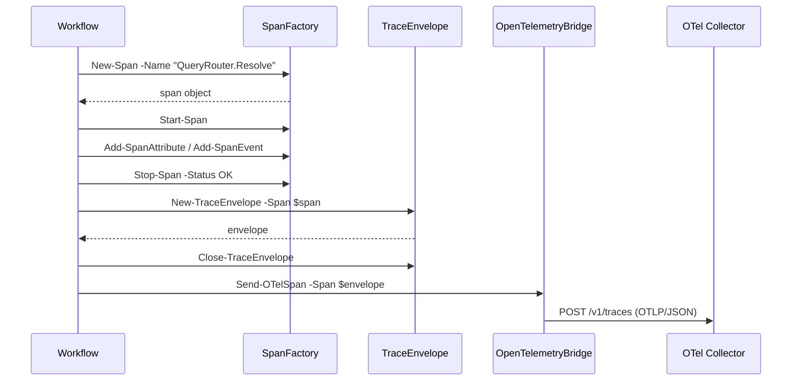
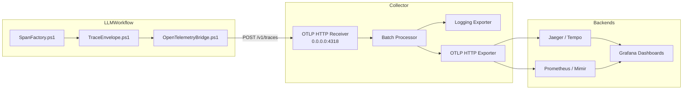

# Observability Architecture

This document describes the observability backbone for the LLMWorkflow platform, including trace schema, correlation ID propagation, module interactions, and collector configuration.

## Related Docs
- [Post-0.9.6 Strategic Execution Plan](../implementation/LLMWorkflow_Post_0.9.6_Strategic_Execution_Plan.md)
- [Implementation Progress](../implementation/PROGRESS.md)
- [Remaining Work](../implementation/REMAINING_WORK.md)
- [Evaluation Operations](../operations/EVALUATION_OPERATIONS.md)

---

## Table of Contents

- [Overview](#overview)
- [Design Principles](#design-principles)
- [Module Responsibilities](#module-responsibilities)
- [Trace Schema](#trace-schema)
- [Correlation ID Propagation](#correlation-id-propagation)
- [OpenTelemetry Integration](#opentelemetry-integration)
- [Collector Configuration](#collector-configuration)
- [Deployment Diagram](#deployment-diagram)

---

## Overview

The observability backbone consists of three PowerShell telemetry modules and a minimal OpenTelemetry Collector configuration. The system emits W3C-compatible trace contexts over HTTP to a collector endpoint, enabling operators to diagnose latency, failures, and cross-component interactions across the LLMWorkflow platform.

---

## Design Principles

| Principle | Implementation |
|-----------|----------------|
| **Minimal Intrusion** | Telemetry modules are opt-in; failures degrade to warnings without halting workflows. |
| **PowerShell 5.1 Compatible** | No external dependencies; uses `Invoke-RestMethod` and built-in cryptography. |
| **Correlation-Aware** | Every trace supports an optional `correlationId` that bridges logs, spans, and evaluation events. |
| **OTLP-Aligned** | Spans are serialized into OTLP/JSON payloads for direct ingestion by standard collectors. |

---

## Module Responsibilities

### SpanFactory.ps1

`SpanFactory.ps1` generates valid trace and span identifiers and manages span lifecycles.

| Function | Purpose |
|----------|---------|
| `New-TraceId` | Generates a 32-character lowercase hexadecimal trace ID. |
| `New-SpanId` | Generates a 16-character lowercase hexadecimal span ID. |
| `New-Span` | Creates a span object with metadata, attributes, and event storage. |
| `Start-Span` | Records the UTC start timestamp and marks the span as started. |
| `Stop-Span` | Records the UTC end timestamp, sets the status, and finalizes the span. |
| `Add-SpanAttribute` | Adds or updates a key-value attribute on the span. |
| `Add-SpanEvent` | Appends a named, timestamped event with optional attributes. |

### TraceEnvelope.ps1

`TraceEnvelope.ps1` defines the envelope schema used for serialization and export.

| Function | Purpose |
|----------|---------|
| `New-TraceEnvelope` | Creates an envelope from a `Span` object or from raw parameters. |
| `Add-TraceEvent` | Appends an event to the envelope without mutating the original span. |
| `Close-TraceEnvelope` | Finalizes the envelope by setting the end time and status. |

The envelope schema includes:

- `traceId` (string, 32-char hex)
- `spanId` (string, 16-char hex)
- `parentSpanId` (string or null)
- `name` (string)
- `startTime` (ISO 8601 UTC)
- `endTime` (ISO 8601 UTC)
- `attributes` (hashtable)
- `events` (array)
- `status` (`UNSET`, `OK`, `ERROR`)
- `correlationId` (string or null)
- `schemaVersion` (integer)
- `isClosed` (boolean)

### OpenTelemetryBridge.ps1

`OpenTelemetryBridge.ps1` handles HTTP transport to the collector.

| Function | Purpose |
|----------|---------|
| `New-OTelTrace` | Initializes a trace context with a trace ID and optional correlation ID. |
| `Send-OTelSpan` | POSTs a single span to the OTLP HTTP receiver. |
| `Export-OTelBatch` | POSTs multiple spans in a single OTLP `resourceSpans` payload. |

Transport behavior:
- Default endpoint: `http://localhost:4318/v1/traces`
- Content-Type: `application/json`
- Timeout: 30 seconds (configurable)
- Safe degradation: network failures return a structured result object and emit a warning.

---

## Trace Schema

### Span Lifecycle



### Attribute Conventions

The following attributes are recommended for consistency across the platform:

| Attribute | Used In | Description |
|-----------|---------|-------------|
| `llmworkflow.component` | All spans | Component name (e.g., `QueryRouter`). |
| `llmworkflow.operation` | All spans | Operation name (e.g., `Resolve`). |
| `llmworkflow.runId` | Root spans | Run identifier from `RunId.ps1`. |
| `correlation.id` | All spans | Injected automatically when present. |
| `evaluation.score` | Evaluation spans | Normalized score (0.0–1.0). |
| `error.message` | ERROR spans | Human-readable failure reason. |

---

## Correlation ID Propagation

Correlation IDs link related operations across process boundaries, pack boundaries, and evaluation boundaries.

### Propagation Rules

1. **Root Span**: If a `correlationId` is provided to `New-OTelTrace` or `New-Span`, it is stored in the span and later serialized as the `correlation.id` attribute.
2. **Child Spans**: When creating a child span, propagate the parent's `correlationId` unless overridden.
3. **Cross-Pack Operations**: `InterPackTransport` and `CrossPackArbitration` should stamp the same `correlationId` on all participating spans.
4. **Evaluation Events**: Evaluation events (see `EVALUATION_OPERATIONS.md`) include the same `correlationId` so dashboards can join traces with scores.

### Example

```powershell
$correlationId = (Get-CurrentRunId)
$ctx = New-OTelTrace -CorrelationId $correlationId

$span = New-Span -Name "QueryRouter.Resolve" -TraceId $ctx.traceId -CorrelationId $ctx.correlationId |
    Start-Span

# ... do work ...

$span = $span | Stop-Span -Status OK
$envelope = New-TraceEnvelope -Span $span | Close-TraceEnvelope
Send-OTelSpan -Span $envelope
```

---

## OpenTelemetry Integration

The bridge converts internal span objects into OTLP/JSON payloads compatible with OpenTelemetry Collector receivers.

### Payload Structure

```json
{
  "resourceSpans": [{
    "resource": {
      "attributes": [
        { "key": "service.name", "value": { "stringValue": "llmworkflow" } }
      ]
    },
    "scopeSpans": [{
      "scope": { "name": "llmworkflow.telemetry", "version": "1.0.0" },
      "spans": [ { ... } ]
    }]
  }]
}
```

### Type Mapping

| PowerShell Type | OTLP Type |
|-----------------|-----------|
| `string` | `stringValue` |
| `int`, `long`, `double` | `doubleValue` |
| `bool` | `boolValue` |
| Other | Coerced to `stringValue` |

---

## Collector Configuration

The collector configuration is located at:

```
configs/observability/otel-collector.yaml
```

### Receivers

- **OTLP HTTP** on `0.0.0.0:4318` with CORS enabled for local dashboard access.

### Processors

- **Batch**: Buffers up to 1024 spans with a 1-second timeout.
- **Memory Limiter**: Caps memory at 512 MiB with 128 MiB spike protection.

### Exporters

- **Logging**: Writes traces to the collector's own logs for quick verification.
- **OTLP/HTTP**: Forwards to an optional upstream endpoint (default: `http://localhost:4318`).

### Running the Collector

```bash
docker run -p 4318:4318 \
  -v $(pwd)/configs/observability/otel-collector.yaml:/etc/otelcol-contrib/config.yaml \
  otel/opentelemetry-collector-contrib:latest
```

---

## Deployment Diagram



---

## See Also

- `docs/operations/EVALUATION_OPERATIONS.md` — Linking evaluation events to traces and dashboards.
- `tests/Telemetry.Tests.ps1` — Pester test suite for the telemetry modules.
