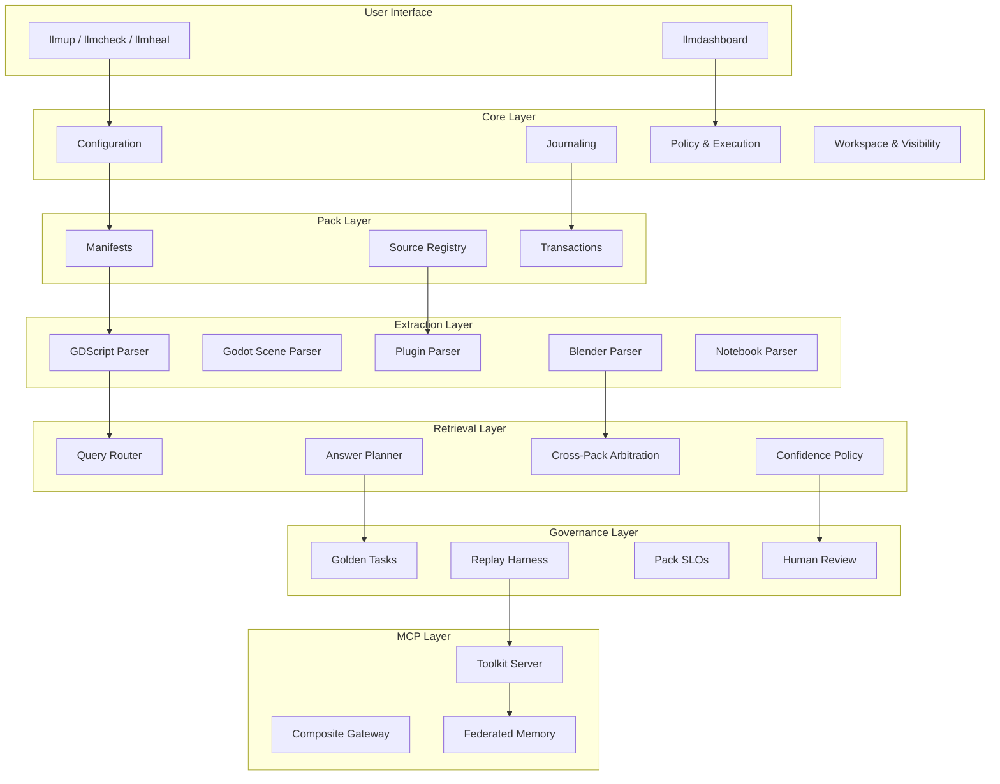
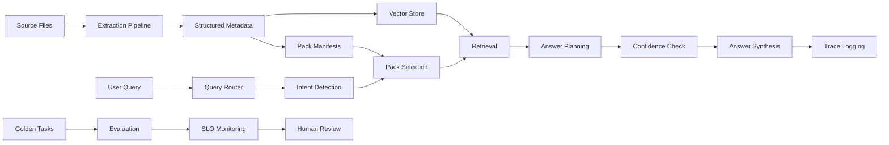

# LLM Workflow Platform — Overview

**Version:** 0.9.6  
**Last Updated:** 2026-04-13  
**Total Functions:** 800+ | **Modules:** 220 | **Domain Packs:** 10

## Related Docs
- [Architecture](./ARCHITECTURE.md)
- [Post-0.9.6 Strategic Execution Plan](../implementation/LLMWorkflow_Post_0.9.6_Strategic_Execution_Plan.md)
- [Implementation Progress](../implementation/PROGRESS.md)
- [Remaining Work](../implementation/REMAINING_WORK.md)

---

## 1. Executive Summary

### What is the LLM Workflow Platform?

The **LLM Workflow Platform** is a comprehensive, enterprise-grade system for structured knowledge management, AI-assisted development, and domain-specific tool integration. It unifies three core capabilities:

- **CodeMunch Pro** — Project indexing and MCP wrapper for AI tool integration
- **ContextLattice** — Project bootstrap and connectivity verification
- **MemPalace** — Incremental memory bridge with persistent context across sessions

### Platform Scale

| Metric | Count |
|--------|-------|
| **Domain Packs** | 10 |
| **PowerShell Modules** | 220 |
| **Exported Functions** | 800+ |
| **Extraction Parsers** | 30 |
| **Retrieval Profiles** | 25+ |
| **Golden Tasks** | 60 |
| **Supported File Formats** | 30+ |

### Target Audiences

| Audience | Use Cases |
|----------|-----------|
| **Game Developers** | RPG Maker MZ plugins, Godot Engine 2D/3D/XR, Blender 3D assets |
| **AI/ML Engineers** | Agent simulation, voice synthesis, notebook workflows |
| **API Developers** | Reverse engineering, OpenAPI generation, traffic analysis |
| **Data Scientists** | Jupyter notebook analysis, pandas workflows, visualization |
| **Frontend Developers** | UI component libraries, design systems, dashboard patterns |
| **ML Learners** | Educational references, deep learning curricula |

---

## 2. Architecture Overview

### Layer Architecture

```
┌─────────────────────────────────────────────────────────────────┐
│  LAYER 7: MCP & External Integration                            │
│  ├── MCPToolkitServer.ps1 (MCP wrapper)                         │
│  ├── MCPCompositeGateway.ps1 (multi-provider)                   │
│  └── ExternalIngestion.ps1 (API ingestion)                      │
├─────────────────────────────────────────────────────────────────┤
│  LAYER 6: Governance & Trust                                    │
│  ├── HumanAnnotations.ps1 (7 annotation types)                  │
│  ├── GoldenTasks.ps1 (10 predefined tasks)                      │
│  ├── ReplayHarness.ps1 (regression testing)                     │
│  ├── PackSLOs.ps1 (telemetry & SLOs)                            │
│  └── HumanReviewGates.ps1 (approval workflows)                  │
├─────────────────────────────────────────────────────────────────┤
│  LAYER 5: Retrieval & Answer Integrity                          │
│  ├── QueryRouter.ps1 (intent detection)                         │
│  ├── RetrievalProfiles.ps1 (25+ profiles)                       │
│  ├── AnswerPlan.ps1 (planning & tracing)                        │
│  ├── CrossPackArbitration.ps1 (dispute resolution)              │
│  ├── ConfidencePolicy.ps1 (4-factor scoring)                    │
│  ├── EvidencePolicy.ps1 (authority validation)                  │
│  ├── CaveatRegistry.ps1 (known falsehoods)                      │
│  ├── RetrievalCache.ps1 (LRU caching)                           │
│  └── IncidentBundle.ps1 (root cause analysis)                   │
├─────────────────────────────────────────────────────────────────┤
│  LAYER 4: Structured Extraction (25 Parsers)                    │
│  ├── GDScriptParser.ps1 (Godot)                                 │
│  ├── GodotSceneParser.ps1 (.tscn/.tres)                         │
│  ├── RPGMakerPluginParser.ps1 (MZ plugins)                      │
│  ├── BlenderPythonParser.ps1 (Blender addons)                   │
│  ├── GeometryNodesParser.ps1 (node trees)                       │
│  ├── ShaderParser.ps1 (shaders)                                 │
│  ├── NotebookParser.ps1 (Jupyter)                               │
│  ├── OpenAPIExtractor.ps1 (API specs)                           │
│  ├── VoiceModelExtractor.ps1 (TTS configs)                      │
│  ├── TrafficCaptureParser.ps1 (HAR/mitmproxy)                   │
│  └── ... 15 more domain-specific parsers                        │
├─────────────────────────────────────────────────────────────────┤
│  LAYER 3: Workflow & Operations                                 │
│  ├── Planner.ps1 (execution plans)                              │
│  ├── HealthScore.ps1 (0-100 scoring)                            │
│  ├── GitHooks.ps1 (pre-commit/push)                             │
│  ├── Compatibility.ps1 (semver & drift)                         │
│  ├── Filters.ps1 (include/exclude patterns)                     │
│  └── Notifications.ps1 (webhooks)                               │
├─────────────────────────────────────────────────────────────────┤
│  LAYER 2: Pack Framework                                        │
│  ├── PackManifest.ps1 (lifecycle management)                    │
│  ├── SourceRegistry.ps1 (trust tiers)                           │
│  └── PackTransaction.ps1 (build/promote/rollback)               │
├─────────────────────────────────────────────────────────────────┤
│  LAYER 1: Core Infrastructure                                   │
│  ├── Journal.ps1 (checkpoint entries)                           │
│  ├── FileLock.ps1 (cross-platform locking)                      │
│  ├── AtomicWrite.ps1 (state safety)                             │
│  ├── Config*.ps1 (5-level precedence)                           │
│  ├── Policy.ps1 (safety gates)                                  │
│  ├── ExecutionMode.ps1 (7 modes)                                │
│  ├── Workspace.ps1 (multi-tenancy)                              │
│  └── Visibility.ps1 (secret scanning)                           │
└─────────────────────────────────────────────────────────────────┘
```

### Component Interactions



### Data Flow



---

## 3. Domain Packs Detail

| Pack | Domain | Key Sources | Primary Use Cases |
|------|--------|-------------|-------------------|
| **godot-engine** | game-dev | Godot official + 20+ community repos (gdext, godot-cpp, godot-jolt, GodotSteam, etc.) | 2D/3D/XR game development, GDScript, visual systems, Steam integration |
| **blender-engine** | 3d-graphics | Blender API, BlenderProc, BlenderGIS, BlenderGPT, MMD tools | 3D modeling, synthetic data generation, Geometry Nodes, MCP control |
| **rpgmaker-mz** | game-dev | RPG Maker core JS + 20+ plugin repos (GabeMZ, Cyclone, TheoAllen, etc.) | JRPG development, plugin creation, conflict diagnosis, notetag extraction |
| **api-reverse-tooling** | api-dev | mitmproxy2swagger, mitmproxy, OpenAPI Generator, Swagger Codegen | API reverse engineering, traffic capture, OpenAPI spec generation |
| **notebook-data-workflow** | data-science | mito, pandas, Jupyter, numpy, matplotlib, seaborn, plotly | Data analysis, notebook manipulation, DataFrame operations, visualization |
| **agent-simulation** | ai-agents | ai-town, LangChain, LangGraph, Semantic Kernel, ChromaDB | AI agent development, multi-agent orchestration, RAG patterns |
| **voice-audio-generation** | audio-ai | OpenVoice, Coqui TTS, FairSeq, VITS, StyleTTS2 | Voice synthesis, voice cloning, TTS pipelines, audio feature extraction |
| **engine-reference** | game-engines | Torque3D, Stingray Engine, Ogre, Gameplay3D | Engine architecture study, ECS patterns, scripting systems |
| **ui-frontend-framework** | frontend-dev | Mithril.js, Tailwind CSS, DaisyUI, TW-Elements, Floating UI | UI component libraries, design systems, dashboard patterns |
| **ml-educational-reference** | ml-education | MIT Deep Learning, D2L, FastAI, TensorFlow Docs, PyTorch Tutorials | ML learning, deep learning curriculum, practical tutorials |

### Pack Install Profiles

All packs support 5 install profiles:

| Profile | Description |
|---------|-------------|
| **core-only** | Minimal public sources for API reference |
| **minimal** | Core + essential tooling |
| **developer** | Balanced public pack with patterns |
| **full** | All promoted public sources |
| **private-first** | Minimal public + strong local emphasis |

---

## 4. Key Capabilities

### 4.1 Structured Extraction (25 Parsers)

| Parser | File Types | Extracts |
|--------|------------|----------|
| GDScript Parser | `.gd` | Classes, signals, methods, @export, @onready |
| Godot Scene Parser | `.tscn`, `.tres` | Node hierarchy, signal connections, resources |
| RPG Maker Plugin Parser | `.js` | Plugin headers, @param, @command, conflicts |
| Blender Python Parser | `.py` | Operators, panels, bpy.props, node groups |
| Geometry Nodes Parser | Node trees | Procedural geometry logic |
| Shader Parser | `.gdshader`, `.shader` | Uniforms, functions, render modes |
| Notebook Parser | `.ipynb` | Cells, outputs, widget state, execution order |
| OpenAPI Extractor | `.json`, `.yaml` | Endpoints, schemas, security schemes |
| Traffic Capture Parser | `.har`, `.flow` | Request/response pairs, path templates |
| Voice Model Extractor | `.json`, `.yaml` | TTS configs, voice encoder patterns |
| Component Library Extractor | `.tsx`, `.jsx`, `.vue` | Component definitions, props, composition |
| Design System Extractor | `.css`, `.scss`, `tailwind.config.js` | Design tokens, themes |
| Agent Pattern Extractor | `.py`, `.ts`, `.js` | State models, multi-agent patterns, tool use |
| Educational Content Extractor | `.md`, `.ipynb` | Tutorial structure, exercises |
| ML Concept Extractor | `.py` | Model architectures, training patterns |
| Engine Architecture Extractor | `.cpp`, `.h` | Component systems, scene graphs |
| Script Runtime Extractor | `.cs`, `.lua`, `.py` | Language bindings, lifecycle hooks |
| DataFrame Pattern Extractor | `.py` | Pandas operations, transforms |
| Vector Store Extractor | `.json`, `.yaml` | RAG configs, retrieval patterns |
| Audio Processing Extractor | `.wav`, `.mp3` | Format handling, feature extraction |

### 4.2 Retrieval with Answer Integrity

**Answer Modes:**
- `direct` — High confidence, answer directly
- `caveat` — Medium confidence, include warnings
- `dispute` — Multiple conflicting sources, surface dispute
- `abstain` — Low confidence, decline to answer
- `escalate` — Needs human review

**Confidence Factors (4-factor scoring):**
1. Relevance score
2. Source authority
3. Consistency across sources
4. Coverage completeness

### 4.3 Cross-Pack Arbitration

```powershell
# Arbitrate across packs
$result = Invoke-CrossPackArbitration -Query "Compare Godot and RPG Maker" -Packs $packs

# Create dispute set for conflicting claims
$dispute = New-DisputeSet -DisputedEntity "Best plugin pattern" -Status "open"
Add-DisputeClaim -DisputeSet $dispute -ClaimSource "godot-engine" -ClaimContent "Use signals"
```

### 4.4 MCP Toolkit Integration

- **MCPToolkitServer.ps1** — MCP server wrapper for CodeMunch
- **MCPCompositeGateway.ps1** — Multi-provider gateway (OpenAI, Claude, Kimi, Gemini, GLM, Ollama)
- **NaturalLanguageConfig.ps1** — Natural language configuration interface
- **FederatedMemory.ps1** — Cross-system memory federation

### 4.5 Inter-Pack Asset Pipelines

| Pipeline | Source Pack | Target Pack | Transport |
|----------|-------------|-------------|-----------|
| Blender → Godot | blender-engine | godot-engine | godot-blender-exporter |
| Notebook → Python | notebook-data-workflow | godot-engine | NotebookParser.ps1 |
| Voice → Animation | voice-audio-generation | blender-engine | lip-sync pipeline |
| ML Model → Godot | ml-educational-reference | godot-engine | ONNX runtime |

### 4.6 Federated Team Memory

- **Multi-Palace Sync** — Sync multiple memory stores
- **ChromaDB Bridge** — Local vector storage
- **ContextLattice API** — Remote memory service
- **Workspace Isolation** — Private/public separation

### 4.7 Performance Benchmarking

**Pack SLOs:**
| Metric | Target |
|--------|--------|
| p95RetrievalLatencyMs | 1200ms |
| answerGroundingRate | 95% |
| parserFailureRate | 2% |
| provenanceCoverage | 99% |
| goldenTaskPassRate | 90% |

---

## 5. File Format Support

### Game Development
| Format | Extensions | Pack |
|--------|------------|------|
| GDScript | `.gd` | godot-engine |
| Godot Scene | `.tscn` | godot-engine |
| Godot Resource | `.tres` | godot-engine |
| Godot Shader | `.gdshader`, `.shader` | godot-engine |
| GDExtension | `.gdextension` | godot-engine |
| JavaScript Plugins | `.js` | rpgmaker-mz |

### 3D Graphics
| Format | Extensions | Pack |
|--------|------------|------|
| Blender Python | `.py` | blender-engine |
| Geometry Nodes | Internal | blender-engine |
| Shader Nodes | Internal | blender-engine |

### Data Science
| Format | Extensions | Pack |
|--------|------------|------|
| Jupyter Notebook | `.ipynb` | notebook-data-workflow |
| Python Data Science | `.py` | notebook-data-workflow |
| CSV/Parquet | `.csv`, `.parquet` | notebook-data-workflow |

### API Development
| Format | Extensions | Pack |
|--------|------------|------|
| OpenAPI Spec | `.json`, `.yaml`, `.yml` | api-reverse-tooling |
| HTTP Archive | `.har` | api-reverse-tooling |
| Mitmproxy Flow | `.flow` | api-reverse-tooling |

### AI/ML
| Format | Extensions | Pack |
|--------|------------|------|
| Python ML | `.py` | agent-simulation, ml-educational-reference |
| TypeScript | `.ts` | agent-simulation |
| JavaScript | `.js` | agent-simulation |
| Voice Config | `.json`, `.yaml` | voice-audio-generation |
| Audio | `.wav`, `.mp3` | voice-audio-generation |

### Frontend
| Format | Extensions | Pack |
|--------|------------|------|
| React/TSX | `.tsx` | ui-frontend-framework |
| React/JSX | `.jsx` | ui-frontend-framework |
| Vue | `.vue` | ui-frontend-framework |
| Svelte | `.svelte` | ui-frontend-framework |
| CSS/SCSS/Less | `.css`, `.scss`, `.less` | ui-frontend-framework |
| Tailwind Config | `tailwind.config.js` | ui-frontend-framework |
| Storybook | `.stories.tsx`, `.stories.jsx` | ui-frontend-framework |

### Game Engines
| Format | Extensions | Pack |
|--------|------------|------|
| C++ Headers | `.h`, `.hpp` | engine-reference |
| C++ Source | `.cpp` | engine-reference |
| C# | `.cs` | engine-reference |
| Lua | `.lua` | engine-reference |

---

## 6. Getting Started

### Quick Start Commands

```powershell
# Install the platform (one-time)
Import-Module .\module\LLMWorkflow\LLMWorkflow.psd1 -Force
Install-LLMWorkflow -NoProfileUpdate

# Bootstrap any project
llmup
# Or: Invoke-LLMWorkflowUp

# Check health
llmcheck
# Or: Test-LLMWorkflowSetup

# Launch dashboard
llmdashboard

# Self-healing diagnostics
llmheal
```

### Example Workflows

**Game Development with Godot:**
```powershell
# Bootstrap Godot project
llmup -GameTeam

# Extract structured metadata from GDScript
$result = Invoke-StructuredExtraction -FilePath "player.gd"
$result.data.classInfo.className  # "Player"
$result.data.signals              # Signal definitions

# Route query to Godot pack
$result = Invoke-QueryRouting -Query "How do I use signals?" -RetrievalProfile "godot-expert"
```

**RPG Maker MZ Plugin Development:**
```powershell
# Extract plugin metadata
$result = Invoke-StructuredExtraction -FilePath "MyPlugin.js"
$result.data.pluginName           # Plugin name
$result.data.parameters           # @param definitions
$result.data.conflicts            # Conflict signatures

# Diagnose plugin conflicts
$result = Invoke-QueryRouting -Query "Plugin conflict with Yanfly" -RetrievalProfile "conflict-diagnosis"
```

**API Reverse Engineering:**
```powershell
# Extract from HAR file
$result = Invoke-StructuredExtraction -FilePath "capture.har"
$result.data.endpoints            # Discovered endpoints
$result.data.schemas              # Inferred schemas

# Generate OpenAPI spec
$result = Invoke-QueryRouting -Query "Generate OpenAPI from capture" -RetrievalProfile "spec-generation"
```

### Common Use Cases

| Use Case | Commands |
|----------|----------|
| New project setup | `llmup` |
| Health check | `llmcheck`, `llmdashboard` |
| Fix issues | `llmheal` |
| Extract metadata | `Invoke-StructuredExtraction` |
| Query routing | `Invoke-QueryRouting` |
| Create answer plan | `New-AnswerPlan` |
| Check confidence | `Test-AnswerConfidence` |
| Run golden tasks | `Invoke-PackGoldenTasks` |
| Check SLOs | `Get-PackSLOStatus` |

---

## 7. API Quick Reference

### Core Infrastructure

| Module | Key Functions |
|--------|---------------|
| `Journal.ps1` | `New-RunId`, `New-RunManifest`, `New-JournalEntry`, `Get-JournalState` |
| `FileLock.ps1` | `Lock-File`, `Unlock-File`, `Remove-StaleLock` |
| `AtomicWrite.ps1` | `Write-AtomicFile`, `Write-JsonAtomic` |
| `Config.ps1` | `Get-EffectiveConfig`, `Export-ConfigExplanation` |
| `Policy.ps1` | `Test-PolicyPermission`, `Assert-PolicyPermission` |
| `Workspace.ps1` | `Get-CurrentWorkspace`, `New-Workspace` |

### Pack Framework

| Module | Key Functions |
|--------|---------------|
| `PackManifest.ps1` | `New-PackManifest`, `Test-PackManifest`, `Set-PackLifecycleState` |
| `SourceRegistry.ps1` | `New-SourceRegistryEntry`, `Get-RetrievalPrioritySources` |
| `PackTransaction.ps1` | `New-PackTransaction`, `Invoke-PackBuild`, `Invoke-PackPromote` |

### Extraction Pipeline

| Module | Key Functions |
|--------|---------------|
| `ExtractionPipeline.ps1` | `Invoke-StructuredExtraction`, `Invoke-BatchExtraction` |
| `GDScriptParser.ps1` | `Invoke-GDScriptParse`, `Get-GDScriptSignals`, `Get-GDScriptProperties` |
| `RPGMakerPluginParser.ps1` | `Invoke-RPGMakerPluginParse`, `Get-PluginMetadata`, `Test-PluginConflict` |
| `BlenderPythonParser.ps1` | `Invoke-BlenderPythonParse`, `Get-BlenderOperatorCalls` |

### Retrieval & Answer

| Module | Key Functions |
|--------|---------------|
| `QueryRouter.ps1` | `Invoke-QueryRouting`, `Get-QueryIntent` |
| `AnswerPlan.ps1` | `New-AnswerPlan`, `Add-PlanEvidence`, `New-AnswerTrace` |
| `CrossPackArbitration.ps1` | `Invoke-CrossPackArbitration`, `New-DisputeSet` |
| `ConfidencePolicy.ps1` | `Test-AnswerConfidence`, `Get-AnswerMode`, `Test-ShouldAbstain` |
| `CaveatRegistry.ps1` | `Register-Caveat`, `Find-ApplicableCaveats` |

### Governance

| Module | Key Functions |
|--------|---------------|
| `GoldenTasks.ps1` | `Invoke-GoldenTaskEval`, `Invoke-PackGoldenTasks`, `Get-PredefinedGoldenTasks` |
| `ReplayHarness.ps1` | `Invoke-GoldenTaskReplay`, `Compare-ReplayResults`, `Test-Regression` |
| `PackSLOs.ps1` | `New-PackSLO`, `Get-PackSLOStatus`, `Record-Telemetry` |
| `HumanReviewGates.ps1` | `Test-HumanReviewRequired`, `New-ReviewGateRequest`, `Submit-ReviewDecision` |

### Example Invocations

```powershell
# Create run manifest
$runId = New-RunId  # Returns: 20260412T150530Z-a7b3
$manifest = New-RunManifest -RunId $runId -Command "sync" -Args @("--all")

# Acquire lock and write atomically
try {
    $lock = Lock-File -Name "sync" -TimeoutSeconds 30
    Write-AtomicFile -Path "state.json" -Content $data
} finally {
    Unlock-File -Name "sync"
}

# Get effective configuration with explanation
Get-EffectiveConfig -Explain

# Create answer plan
$plan = New-AnswerPlan -Query "How to use X?" `
                       -RetrievalProfile "rpgmaker-expert" `
                       -RequiredEvidenceTypes @("code-example", "api-reference")

# Evaluate confidence
$confidence = Test-AnswerConfidence -Evidence $evidence -AnswerPlan $plan
$mode = Get-AnswerMode -ConfidenceScore $confidence.Score -EvidenceIssues $issues

# Run golden task
$result = Invoke-GoldenTaskEval -Task $task -RecordResults
```

---

## 8. Production Deployment

### MCP Server Deployment

```powershell
# Install MCP toolkit server
Register-MCPToolkitServer -Name "codemunch-pro" -Command "npx codemunch-pro"

# Configure composite gateway for multiple providers
Set-MCPGatewayConfig -Providers @("openai", "claude", "kimi") -FallbackOrder @("openai", "claude")

# Enable federated memory
Enable-FederatedMemory -LocalStore "chromadb" -RemoteStore "contextlattice"
```

### Performance Benchmarking

```powershell
# Run pack evaluation
$results = Invoke-PackGoldenTasks -PackId "rpgmaker-mz" -Parallel

# Check SLO compliance
$status = Get-PackSLOStatus -PackId "rpgmaker-mz" -TimeRange "24h"

# Record telemetry
Record-Telemetry -PackId "rpgmaker-mz" -MetricName "retrievalLatencyMs" -Value 850

# Export health report
Export-HealthReport -CompareWithPrevious
```

### Golden Task Validation

**Sample Golden Tasks (10 shown of 60 total):**

| Task ID | Pack | Description |
|---------|------|-------------|
| gt-rpgmaker-mz-001 | rpgmaker-mz | Plugin skeleton generation |
| gt-rpgmaker-mz-002 | rpgmaker-mz | Conflict diagnosis |
| gt-rpgmaker-mz-003 | rpgmaker-mz | Notetag extraction |
| gt-rpgmaker-mz-004 | rpgmaker-mz | Patch analysis |
| gt-godot-001 | godot | GDScript class extraction |
| gt-godot-002 | godot | Signal connection analysis |
| gt-godot-003 | godot | Autoload setup verification |
| gt-blender-001 | blender | Operator registration |
| gt-blender-002 | blender | Geometry nodes parsing |
| gt-blender-003 | blender | Addon manifest validation |

```powershell
# Run all golden tasks for a pack
$results = Invoke-PackGoldenTasks -PackId "godot" -Parallel

# Replay with new configuration
$replay = Invoke-GoldenTaskReplay -TaskId "gt-rpgmaker-mz-001" `
                                  -BaselineConfig $oldConfig `
                                  -NewConfig $newConfig

# Check for regression
if (Test-Regression -Baseline $before -Current $after) {
    Write-Error "Regression detected!"
}
```

---

## 9. Additional Resources

- **Full Documentation:** [README.md](../../README.md)
- **Architecture Details:** [docs/ARCHITECTURE.md](../../docs/architecture/ARCHITECTURE.md)
- **Troubleshooting:** [docs/TROUBLESHOOTING.md](../../docs/operations/TROUBLESHOOTING.md)
- **Canonical Documents:**
  - [Part 1 — Core Architecture](../../docs/workflow/LLMWorkflow_Canonical_Document_Set_Part_1_Core_Architecture_and_Operations.md)
  - [Part 2 — RPG Maker MZ](../../docs/workflow/LLMWorkflow_Canonical_Document_Set_Part_2_RPGMaker_MZ_Pack_and_Acceptance.md)
  - [Part 3 — Godot, Blender, Inter-Pack](../../docs/workflow/LLMWorkflow_Canonical_Document_Set_Part_3_Godot_Blender_InterPack_and_Roadmap.md)
  - [Part 4 — Future Pack Intake](../../docs/workflow/LLMWorkflow_Canonical_Document_Set_Part_4_Future_Pack_Intake_and_Source_Candidates.md)

---

*End of Platform Overview*

